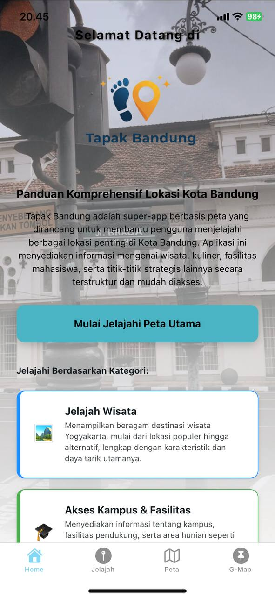
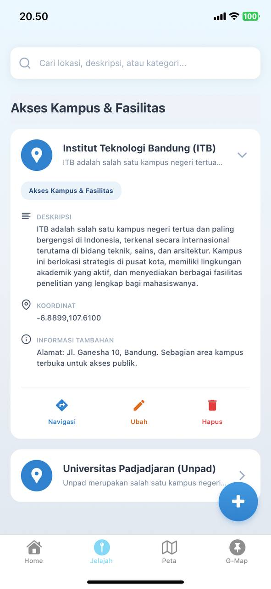
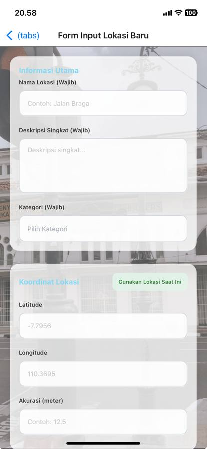
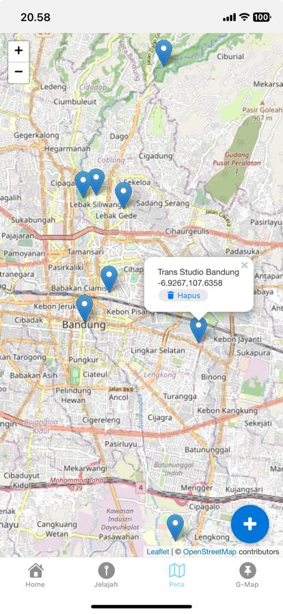
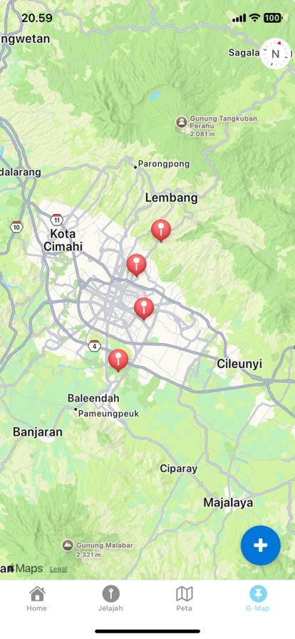

🗺️ TAPAK BANDUNG: PETA DIGITAL EKSPLORASI KOTA

Tapak Bandung adalah sebuah super-app berbasis peta yang dirancang untuk membantu pengguna, mulai dari wisatawan, mahasiswa, hingga masyarakat lokal, dalam menjelajahi dan menemukan berbagai lokasi penting di Kota Bandung. Aplikasi mobile ini menggabungkan destinasi wisata, kampus, fasilitas publik, dan kuliner dalam satu platform interaktif, memberikan pengalaman navigasi yang cepat, akurat, dan informatif.

📝 Deskripsi Produk

Tapak Bandung dikembangkan menggunakan teknologi React Native + Expo untuk memastikan performa cepat di berbagai perangkat mobile. Tujuan utamanya adalah menyajikan informasi geospasial secara terstruktur dan mudah diakses.

Sasaran Pengguna

Mahasiswa Baru: Mempercepat adaptasi dan penemuan fasilitas akademik serta hunian.

Wisatawan: Panduan digital untuk eksplorasi tempat wisata populer dan tersembunyi.

Masyarakat Lokal: Memudahkan pencarian fasilitas publik dan layanan terdekat.

🧩 Fitur Utama Aplikasi

Fitur

Ikon

Fungsi

Manfaat Utama

Peta Interaktif

🗺️

Menampilkan seluruh Point of Interest (POI) Bandung dalam peta digital dinamis.

Visualisasi lokasi yang intuitif.

Detail Lokasi (Preview)

ℹ️

Menyediakan deskripsi, rating, koordinat, dan kategori tiap titik.

Informasi lokasi yang lengkap dan cepat.

Google Maps Integration

📍

Navigasi langsung (1-klik) ke Google Maps untuk rute.

Memastikan rute perjalanan yang akurat.

Sistem Kategori

🗃️

Pengelompokan lokasi utama: Wisata, Kampus, Fasilitas Umum.

Filter pencarian yang efisien.

UI & Navigasi Ringan

⚡

Tampilan modern, responsif, dan waktu load cepat khas React Native.

Pengalaman pengguna yang mulus.

🛠️ Teknologi Pembangun

Teknologi

Kategori

Peran dalam Proyek

React Native + Expo

Framework Utama

Pengembangan cross-platform (Android & iOS) dari satu kode sumber.

TypeScript / JavaScript

Bahasa Pemrograman

Menjamin tipe data yang ketat dan kode yang lebih stabil.

React Native Maps

Library Peta

Menyediakan komponen peta interaktif dan manajemen marker lokasi.

Expo Router

Navigasi

Manajemen routing (halaman) aplikasi yang modern dan efisien.

Firebase Realtime Database

Basis Data (Opsional)

Penyimpanan data POI lokasi secara real-time untuk pembaruan cepat.

📚 Struktur Data & Sumber

1. Struktur Data Firestore

Semua data lokasi disimpan dalam koleksi points/ dengan format dokumen yang terstruktur:

points/{id_lokasi} : {
    "name": "nama_lokasi",
    "category": "Wisata", // atau Kampus, Fasilitas Umum
    "description": "deskripsi_singkat_lokasi",
    "coordinates": {
        "latitude": -6.8921, 
        "longitude": 107.6100 
    }
}

2. Sumber Data

Data yang digunakan untuk menandai lokasi bersumber dari observasi digital dan validasi lapangan:

Observasi Geospasial Google Maps

Dataset kampus dan destinasi resmi Kota Bandung

Survei titik fasilitas umum dan layanan strategis.

📸 Preview Tampilan Aplikasi

Berikut adalah pratinjau antarmuka aplikasi Tapak Bandung dalam berbagai mode dan screen.

🎯 Tujuan Pengembangan PGPBL 2025

Tapak Bandung bertujuan untuk memenuhi kriteria proyek PGPBL 2025 dengan:

Menghadirkan panduan digital modern dan user-friendly untuk eksplorasi Kota Bandung.

Menciptakan platform interaktif yang mengintegrasikan data geografis, budaya, dan fasilitas akademik.

Mempercepat dan mempermudah navigasi ke berbagai destinasi penting bagi semua segmen pengguna.

Proyek ini dikembangkan untuk Program PGPBL 2025.
